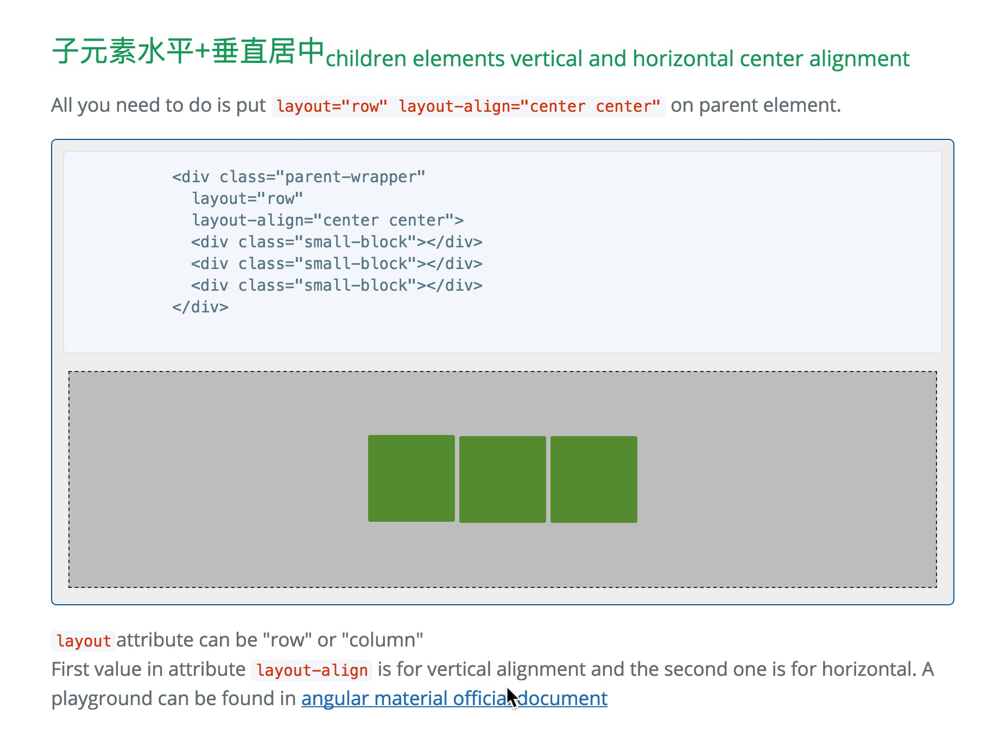

# ng-flex-layout
--
Pull from Angular Material. Make flex box layout much easier!  

## Install
* use bower: `bower install ng-flex-layout`
* Or, download the compiled and minified css file [here](https://raw.githubusercontent.com/ShaneXie/ng-flex-layout/master/css/flex-layout.min.css).  
Then inject the css file into your html  
`<link rel="stylesheet" href="bower_components/ng-flex-layout/css/flex-layout.min.css" />`

## Usage
On the [project page](http://shanexie.github.io/ng-flex-layout/), there are some simple examples.  
For more details of this library, please check out the [official document](https://material.angularjs.org/latest/#/layout/container)

## Build from sass
First install sass, e.g. on mac: `gem install sass`  
Then run `pyuthon ./builder/generater.py` command in the project folder.  
This command will build and minify the `./scss/flex-layout.scss` source file into `css` folder.
